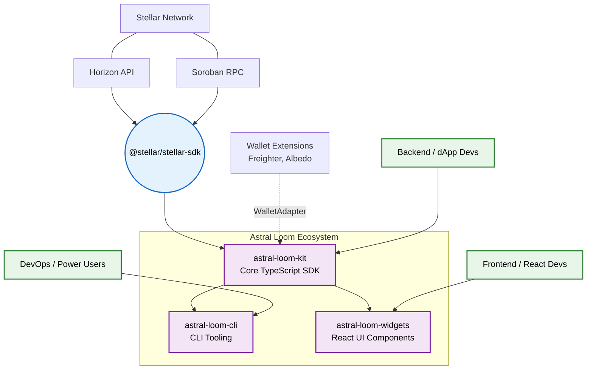

<div align="center">
  <h1>🧵 Astral Loom Kit</h1>
  <p><strong>Core TypeScript SDK wrapping @stellar/stellar-sdk into higher-level utilities.</strong></p>
  
  [](https://www.npmjs.com/package/astral-loom-kit)
  [](https://github.com/astral-loom/astral-loom-kit/actions/workflows/ci.yml)
  [](https://opensource.org/licenses/MIT)
  
  🌐 Website: https://astral-loom-site.vercel.app
</div>

---

## 📖 Overview

`astral-loom-kit` is a unified integration toolkit for Stellar dApp developers. It wraps the core `@stellar/stellar-sdk` into simpler, higher-level utilities so developers don't have to re-implement common boilerplate.

### 🏗️ Architecture

The SDK is split into several domain-specific helpers:

1. **Wallets:** Unified adapters for Freighter and Albedo.
2. **Transactions:** Builders for common operations like payments, batch payments, path payments, and trustlines.
3. **Networks:** Config presets for testnet, mainnet, and futurenet.
4. **Errors:** Human-readable error mapping for cryptic Horizon/SDK errors.

### 🌍 Ecosystem Architecture

`astral-loom-kit` is the core logic engine of the Astral Loom ecosystem. It powers our CLI tooling and React components.



---

## 🚀 Quick Start

### 1. Installation

Install using npm or yarn:

```bash
npm install astral-loom-kit @stellar/stellar-sdk
```

### 2. Connect a Wallet

Connect to a supported wallet extension and sign transactions.

```typescript
import { FreighterAdapter, AlbedoAdapter } from 'astral-loom-kit';

// You can use any of the supported adapters
const adapter = new FreighterAdapter();
// const adapter = new AlbedoAdapter();

async function connectWallet() {
  const publicKey = await adapter.connect();
  console.log('Connected:', publicKey);
}
```

### 3. Build a Payment Transaction

Construct a payment transaction without signing or submitting it yet.

```typescript
import { buildPayment, buildBatchPayment, buildPathPayment } from 'astral-loom-kit';

const transaction = buildPayment({
  source: 'GA...YOUR_ACCOUNT_ID',
  sourceSequence: '1234567890',
  destination: 'GB...DESTINATION_ID',
  assetCode: 'XLM',
  amount: '10.5',
  network: 'testnet',
});
```

---

## 💡 Examples

We provide runnable examples to help you get started quickly. Check out the [examples/](examples/) directory, including a [simple payment script](examples/simple-payment/) demonstrating how to connect to networks, build transactions, and map errors.

---

## 🤝 Community & Maintainers

We are committed to fostering a welcoming environment. Please read our [Code of Conduct](CODE_OF_CONDUCT.md) before participating. If you discover a vulnerability, please review our [Security Policy](SECURITY.md) for reporting instructions.

Join the discussion and get support:
* **Community Link**: [Stellar Developer Discord](https://discord.gg/5aprtMSyR)

| Maintainer | Role |
|------------|------|
| Temmy2026 | Core Developer |

---

## 🛠️ Contributing

We welcome contributions! Please see our [CONTRIBUTING.md](CONTRIBUTING.md) for details on how to get started.

### 🧑‍💻 Contributors

[](https://github.com/astral-loom/astral-loom-kit/graphs/contributors)